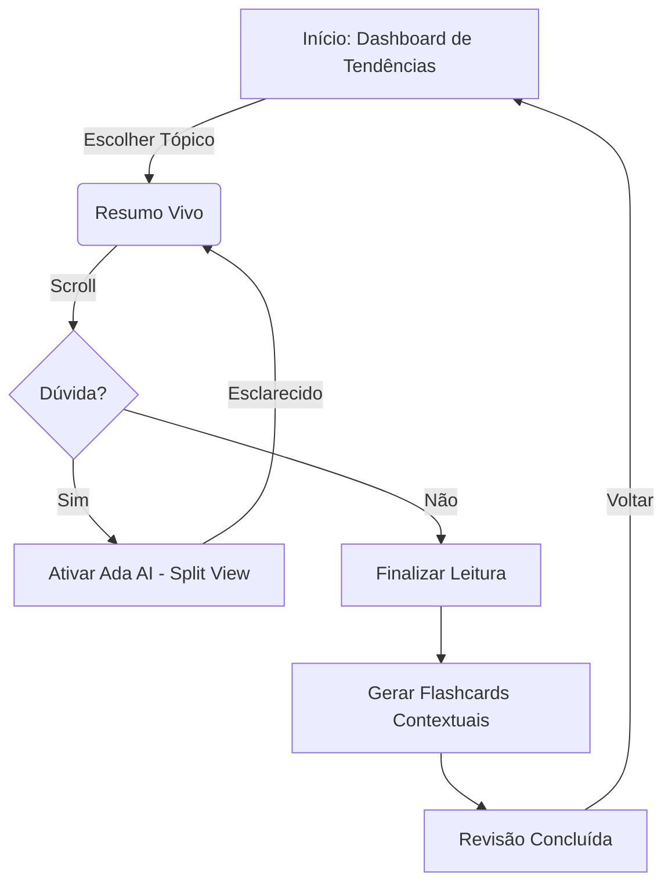

# UX Design Specification Foca na TI - Concursos

**Author:** Thiago
**Date:** 2026-04-18

---

## Executive Summary

### Project Vision
O Foca na TI é uma plataforma EdTech premium projetada para concurseiros da área de tecnologia, focada em produtividade extrema ("Smarter, not harder"). O diferencial reside na união de resumos curados com a **Ada AI** (RAG), que atua como uma tutora contextual, e o **Motor de Tendências**, que transforma o estudo passivo em uma estratégia orientada a dados.

### Target Users
*   **Concurseiros de TI**: Profissionais ou estudantes tecnicamente proficientes, mas com tempo limitado e alta carga de estresse/fadiga cognitiva.
*   **Comportamento de Uso**: Sessões curtas de consulta (mobile, em trânsito) e sessões longas de estudo focado (desktop). Valorizam precisão, velocidade e transparência da informação.

### Key Design Challenges
*   **Densidade com Legibilidade**: Layouts mobile-first que permitam consumir conteúdo técnico denso sem fadiga ocular, utilizando técnicas de *Progressive Disclosure*.
*   **Psicologia da Espera (Ada AI)**: Gerenciar a percepção de latência da IA através de feedbacks visuais dinâmicos e streaming de texto, mantendo o fluxo de aprendizado contínuo.
*   **Autoridade e Confiança**: Design que comunique visualmente a fonte dos dados (contexto RAG) para mitigar a percepção de alucinação da IA.

### Design Opportunities
*   **Estética "Dev-Centric"**: Interface moderna, preferencialmente dark mode, com alta densidade de ferramentas úteis, lembrando dashboards de alto nível (estilo IDE ou ferramentas de monitoramento).
*   **Priorização Proativa**: Transformar o dashboard em um motor de recomendação baseado no Motor de Tendências, reduzindo a paralisia de decisão do aluno.

## Core User Experience

### Defining Experience
A experiência core do Foca na TI é a **"Conversa com o Conteúdo"**. O objetivo é que o usuário sinta que os resumos são vivos e responsivos. O ciclo fundamental é: Consumir Resumo → Surgir Dúvida → Resposta Contextual da Ada AI → Consolidação do Conhecimento.

### Platform Strategy
*   **Primária**: Web App responsivo (PWA), otimizado para navegadores modernos.
*   **Touch-First**: Interações pensadas para uso com uma mão (estudo em trânsito).
*   **Offline Capability**: Sincronização de resumos recentes para leitura sem conexão à internet.

### Effortless Interactions
*   **Auto-Contextualização**: A Ada AI inicia conversas já "lendo" o que está no viewport do usuário, eliminando a necessidade de copiar/colar trechos.
*   **Busca Semântica Direta**: Encontrar temas complexos através de perguntas naturais, não apenas palavras-chave.

### Critical Success Moments
*   **Validação por Fonte**: Quando a Ada responde e aponta exatamente o fragmento do resumo que sustenta a explicação.
*   **Economia de Tempo**: O momento em que o aluno encontra o "o que estudar agora" em menos de 10 segundos através do Motor de Tendências.

### Experience Principles
1.  **Relevância em Primeiro Lugar**: O que não cai no concurso não aparece no resumo.
2.  **IA como Extensão, não Substituta**: A Ada ajuda a entender o conteúdo curado, garantindo a qualidade da informação.
3.  **Fluidez Técnica**: A interface deve parecer uma ferramenta de performance, rápida e sem atritos visuais.
4.  **Resiliência de Acesso**: Estudo garantido em qualquer lugar, com ou sem sinal.

## Desired Emotional Response

### Primary Emotional Goals
O Foca na TI deve ser um **refúgio de clareza** em meio ao caos dos editais. Os principais sentimentos desejados são:
*   **Controle**: O usuário sente que sabe exatamente o que estudar e por quê.
*   **Segurança**: Confiança total de que a IA (Ada) está baseada em dados reais e atualizados.
*   **Foco Profundo**: Uma interface que "desaparece" para que o conteúdo brilhe.

### Emotional Journey Mapping
1.  **Entrada**: Alívio imediato (interface limpa, sem anúncios ou poluição).
2.  **Estudo (Core)**: Estado de Flow (leitura fluída, ajuda instantânea).
3.  **Saída**: Satisfação e Dever Cumprido (visualização clara do que foi vencido no dia).

### Micro-Emotions
*   **Confiança**: Gerada através da citação de fontes em cada intervenção da IA.
*   **Empoderamento**: Sentido ao usar o Motor de Tendências para priorizar o estudo.
*   **Encantamento**: Pequenos detalhes de UI (micro-animações) que tornam o aprendizado menos árduo.

### Design Implications
*   **Implicância 1 (Calma)**: Uso de paleta de cores Dark Mode (Deep Navy/Slate) com acentos suaves.
*   **Implicância 2 (Foco)**: Tipografia de alta performance (Inter/Roboto Mono) e espaçamento generoso.
*   **Implicância 3 (Transparência)**: Elementos visuais que ligam a resposta da Ada ao texto fonte (linhas de conexão ou highlights).

### Emotional Design Principles
1.  **Espaço é Luxo**: Não amontoar informações; priorizar o conforto visual.
2.  **Feedback Amigável**: A IA deve soar como o "colega de estudo sênior", não como um robô.
3.  **Prioridade sobre Volume**: Eliminar tudo que causa ansiedade desnecessária.

## UX Pattern Analysis & Inspiration

### Inspiring Products Analysis
*   **Perplexity AI**: Referência em transparência de dados. A forma como cita fontes e organiza o conhecimento em "cards" inspira a interface da Ada AI.
*   **Linear**: O benchmark para interfaces de alta performance. Uso de atalhos de teclado, design limpo e estética "pro-tool".
*   **Medium**: Excelente no tratamento tipográfico e na remoção de distrações para leitura de longo formato.
*   **Anki**: Inspira o design focado em progresso e na "vitória" diária sobre o conteúdo.

### Transferable UX Patterns
*   **Progressive Disclosure (Revelação Progressiva)**: Esconder detalhes técnicos complexos sob interações de clique, mantendo o resumo inicial escaneável.
*   **Streaming Content Feedback**: Exibir a resposta da IA em tempo real para reduzir a percepção de latência.
*   **Command Palette (Atalhos)**: Sistema de navegação rápida via barra de busca global para acesso instantâneo a qualquer matéria.

### Anti-Patterns to Avoid
*   **Modais Interruptivos**: Evitar cobrir o conteúdo de estudo com avisos ou menus; o foco deve ser ininterrupto.
*   **Excesso de Barras Laterais**: No mobile, evitar menus que roubam largura útil da tela (priorizar design centrado).
*   **Gamificação Infantilizada**: Evitar elementos muito coloridos ou barulhentos; o público é focado em resultados profissionais.

### Design Inspiration Strategy
A estratégia é combinar a **eficiência de uma ferramenta de desenvolvedor** (Linear) com a **fluidez de um portal de notícias premium** (Medium), orquestrada pela **transparência inteligente** de uma IA de busca (Perplexity).

## Design System Foundation

### Design System Choice
A fundação escolhida é o **shadcn/ui** (Radix UI + Tailwind CSS).

### Rationale for Selection
*   **Equilíbrio Estético**: Permite alcançar o look "Pro-Tool" (estilo Vercel/Linear) desejado sem o overhead de bibliotecas proprietárias.
*   **Acessibilidade Nativa**: O uso do Radix UI garante que todos os componentes complexos (acessibilidade via teclado, ARIA) funcionem perfeitamente no mobile e desktop.
*   **Customização Profunda**: Por ser um sistema "headless", não ficamos presos a estilos pré-definidos, facilitando a criação da experiência única da Ada AI.
*   **Performance**: Entrega apenas o CSS necessário via Tailwind, crucial para o carregamento rápido no 4G.

### Implementation Approach
Utilizaremos componentes reusáveis baseados no shadcn/ui, mantendo o código local para máxima agilidade em ajustes de UX. A tipografia será baseada em fontes variáveis para garantir performance e legibilidade.

### Customization Strategy
*   **Tema Tech-Dark**: Criação de um sistema de tokens de cores focado em tons de cinza profundos (`slate`, `zinc`) e azuis elétricos para acentos.
*   **Micro-layouts**: Desenvolvimento de layouts específicos para os resumos Markdown, otimizando o ritmo de leitura e a hierarquia visual.
*   **Ada Chat UI**: Interface de chat sob medida que se integra organicamente à lateral ou base do conteúdo lido.

## 2. Core User Experience

### 2.1 Defining Experience
O Foca na TI gira em torno do **"Resumo Vivo"**. Diferente de um PDF estático, o resumo é a interface principal de interação. O usuário não apenas lê; ele questiona parágrafos, visualiza tendências em tempo real sobre o tópico e recebe apoio da Ada AI sem perder o contexto do estudo.

### 2.2 User Mental Model
O usuário deve migrar do modelo de **"Consumidor Passivo"** (armazenar arquivos que nunca lê) para o de **"Analista de Performance"**. O produto deve ser percebido como um "Painel de Comando" para sua aprovação, onde a informação é filtrada e acionável.

### 2.3 Success Criteria
*   **Aceleração Cognitiva**: O usuário deve resolver uma dúvida técnica complexa em menos de 10 segundos (tempo de interação + resposta da IA).
*   **Transparência Total**: Cada afirmação da Ada AI deve ter uma ligação visual clara com a fonte bibliográfica ou edital presente no resumo.
*   **Ergonomia Mobile**: 90% das interações core no resumo devem ser realizáveis apenas com o polegar (estudo em trânsito).

### 2.4 Novel UX Patterns
*   **Smart Context-Pinning**: A Ada AI não pergunta sobre o que o usuário quer falar; ela utiliza a posição do viewport e o fragmento de Markdown focado para inferir o contexto.
*   **Trend-Driven Highlighting**: Trechos do texto que sofrem alterações de estilo dinâmicas se forem identificados como "quentes" pelo Motor de Tendências no momento do estudo.

### 2.5 Experience Mechanics
1.  **Iniciação**: O usuário faz scroll no resumo e ícones de "Radar" ou "Ajuda" aparecem adjacentes a blocos de texto.
2.  **Interação**: Toque em um termo ou ícone -> Expansão instantânea de mini-painel da Ada.
3.  **Feedback**: Enquanto a Ada "digita", o trecho correspondente no resumo ganha um brilho sutil (*glow*) para manter o foco.
4.  **Conclusão**: O insight gerado pode ser salvo como um "Snippet de Revisão" no dashboard pessoal.

## Visual Design Foundation

### Color System
A paleta segue o conceito **"Tech-Dark Dashboard"**, priorizando contraste e foco para longas sessões de estudo.
*   **Backdrop**: `Slate-950` (#020617) para o fundo principal, `Slate-900` para componentes.
*   **Ação Primária**: `Indigo-500` (#6366f1) - Cor de inteligência e foco.
*   **Status/Tendências**: `Emerald-500` (Tendência em alta), `Amber-500` (Atenção/Interessante), `Rose-500` (Erro/Crítico).
*   **Ada AI Gradient**: `Indigo-500` para `Cyan-400`.

### Typography System
*   **UI & Conteúdo**: **Inter** (Sans-serif) - Padrão de legibilidade e modernidade. Escala harmonizada com pesos regular, medium e bold.
*   **Dados & Técnica**: **JetBrains Mono** - Utilizada para dados brutos do motor de busca, referências bibliográficas e informações de performance.
*   **Hierarquia**: H1-H3 grandes e limpos, body com line-height de 1.6 para leitura confortável no Markdown.

### Spacing & Layout Foundation
*   **Grid**: Sistema rítmico de **8px**.
*   **Layout**: Estrutura densa mas respirável. Cards com bordas finas (`border-slate-800`) e cantos levemente arredondados (`rounded-lg`).
*   **Mobile-First**: Margens laterais de 16px no mobile, expandindo para colunas centrais no desktop.

### Accessibility Considerations
*   **Contraste**: Todos os textos principais mantêm ratio WCAG AA (mínimo 4.5:1).
*   **Interatividade**: Área de clique mínima de 44x44px. Inclusão de estados visuais claros para foco (teclado).
*   **Modo Offline**: Indicadores visuais discretos de conteúdo baixado/sincronizado.

## Design Direction Decision

### Design Directions Explored
Exploramos 6 direções distintas, variando de interfaces puramente informativas a experiências focadas em IA nativa. As opções incluíram layouts em grid (Bento), estética hacker/terminal e leitores minimalistas.

### Chosen Direction
A direção escolhida é o **Híbrido Linear + Split View**.
Esta abordagem utiliza uma barra lateral persistente para navegação e contexto (estilo ferramentas de produtividade como Linear/HSlack), com um painel central que se divide em uma visão "split" dinâmica quando a Ada AI ou o Motor de Tendências são ativados.

### Design Rationale
Esta escolha equilibra a necessidade de **organização estruturada** do aluno (edital/tópicos) com a **interatividade fluida** da IA. A barra lateral garante que o aluno nunca se sinta perdido na imensidão de conteúdos de TI, enquanto o Split View permite que ele consulte a Ada sem perder o ponto de leitura original, reforçando o modelo mental de "Analista de Performance".

### Implementation Approach
Utilizaremos `Resizable Panels` do shadcn/ui para permitir que o usuário ajuste a largura da Ada conforme a necessidade. A navegação lateral será colapsável no mobile para priorizar o "Resumo Vivo".

## User Journey Flows

### 1. Descoberta Estratégica
*O aluno entra querendo saber "O que cai?"*
*   **Trigger**: Notificação de novo resumo ou entrada via Dashboard.
*   **Ação**: Filtra pelo edital alvo -> Visualiza o Motor de Tendências (Mapa de Calor).
*   **Sucesso**: O usuário identifica o tópico de maior peso/tendência e inicia a leitura.

### 2. O "Resumo Vivo" (Loop de Estudo)
*O momento central de aprendizado interactivo.*

### 3. Fechamento de Ciclo (Flashcards IA)
*Fixação do conteúdo lido através de S.R.S (Spaced Repetition).*
*   **Conclusão**: Ao terminar o resumo, a Ada sugere flashcards baseados nas interações reais (dúvidas) que o aluno teve.
*   **Hábito**: Ciclo de resposta rápida (Correto/Errado) que alimenta o ranking de performance.

### Journey Patterns
*   **Progressive Disclosure**: Detalhes técnicos e tendências estatísticas ficam ocultos sob ícones até que o usuário manifeste interesse.
*   **Contextual Actions**: A interface se adapta; se o tópico é prático (ex: Comandos Linux), a Ada oferece um terminal interativo.

### Flow Optimization Principles
*   **Aha! em 3 Cliques**: O usuário deve chegar ao primeiro resumo útil em no máximo 3 toques a partir da Home.
*   **Feedback Instantâneo**: Cada progresso de leitura deve ser visualmente gratificante (barras de progresso fluídas).

## Component Strategy

### Design System Components
Utilizaremos a biblioteca **shadcn/ui** como base, aproveitando os seguintes componentes principais para garantir consistência e acessibilidade:
*   `AppSidebar`: Navegação principal estruturada por concursos e editais.
*   `Resizable`: Painéis para o Split-View dinâmico entre o Resumo e a Ada AI.
*   `Tabs`: Alternância entre as visões de conteúdo ("Resumo", "Analítico", "Review").
*   `ScrollArea`: Implementação de scroll customizado visando performance em conteúdos longos.

### Custom Components
Desenvolveremos componentes específicos para as necessidades únicas da plataforma:
*   **AdaChatPane**: Interface de conversação especializada em apoio pedagógico, com suporte a streaming de texto e destacamento visual de referências no resumo.
*   **TrendHeatmap**: Componente de visualização de dados (SVG) que mapeia a incidência estatística de temas do edital diretamente na interface de seleção.
*   **SummaryBlock**: Bloco base de leitura de resumos Markdown com menu de ações flutuante (IA de contexto) integrado à margem lateral.
*   **SRSFlashcard**: Card interativo com lógica de repetição espaçada, utilizando Framer Motion para animações de rotação e feedback visual de dificuldade.

### Component Implementation Strategy
A estratégia de implementação foca em **Atomic Design**. Todos os componentes customizados herdarão os tokens de cores e tipografia definidos na `Visual Foundation`, garantindo que o Dark Mode e o tema "Tech" sejam aplicados uniformemente.

### Implementation Roadmap
1.  **Fase 1 (Core Shell)**: Interface Base, Sidebar, Visualização de Markdown e Split-View.
2.  **Fase 2 (IA Intelligence)**: Integração do AdaChatPane e lógicas de contexto da IA.
3.  **Fase 3 (Performance Metrics)**: TrendHeatmap, SRSFlashcard e Dashboard de Produtividade.

## UX Consistency Patterns

### Button Hierarchy
*   **Ação Primária**: Gradiente `Indigo-500` para `Cyan-400`. Destinado a ações de progresso (Ex: "Finalizar Estudo") e ativação da Ada AI.
*   **Ação Secundária**: Estilo `Ghost` ou `Outline` em `Slate-800`. Utilizado para navegação secundária e filtros de edital.
*   **Ação Destrutiva**: Estilo `Solid Rose-600`. Restrito a remoção de progresso ou logs de estudo.

### Feedback Patterns
*   **Streaming de IA**: Utilização de cursor pulsante e animação de digitação para indicar que a Ada está gerando conteúdo técnico complexo.
*   **Skeletons Cognitivos**: Enquanto o motor de busca processa o edital, a interface exibe blocos de esqueleto que seguem a estrutura do Markdown para reduzir o esforço cognitivo.
*   **Toasts**: Notificações curtas e persistentes no canto superior para feedback de salvamento de flashcards e sincronização offline.

### Navigation Patterns
*   **Vertical Hierarchy**: A sidebar mantém a estrutura de árvore do concurso. O item ativo recebe um `Indigo-accent` e um brilho lateral sutil.
*   **Breadcrumbs Dinâmicos**: Localizados no topo de cada resumo, permitindo volta rápida para "Concurso > Matéria > Tópicos".

### AI Transparency Pattern
*   **Source Anchors**: Cada parágrafo ou resposta da Ada contém um pequeno ícone de "âncora". Ao clicar, o sistema ilumina automaticamente o trecho correspondente no arquivo Markdown do resumo ou edital original.

### Empty States
*   **Radar Style**: Utilização de ilustrações técnicas minimalistas ("Scanning for Trends") quando o usuário ainda não escolheu um concurso alvo ou não há dados de tendência para o dia.

## Responsive Design & Accessibility

### Responsive Strategy
*   **Mobile-First**: Prioridade para interação com o polegar. A Ada AI e menus de filtros utilizam drawers inferiores (`Sheets`) para ergonomia.
*   **Desktop-View**: Layout expandido em 3 colunas [Navegação | Resumo Principal | Ada & Tendências]. Foco em densidade de informação para estudo intenso.
*   **Tablet**: Ajuste híbrido com sidebar colapsável e painel da Ada sobreposto sob demanda para maximizar a área de leitura.

### Breakpoint Strategy
Utilizaremos os padrões do Tailwind CSS para manter a consistência com o ecossistema de componentes:
*   `Mobile`: < 768px (iPhone/Android standard)
*   `Tablet`: 768px - 1024px (iPad/Android Tablets)
*   `Desktop`: > 1024px (Laptops e Monitores)

### Accessibility Strategy
*   **Conformidade**: Meta de WCAG 2.1 Nível AA.
*   **Navegação por Teclado**: Estrutura de `Skip Links` para pular diretamente para o resumo e anéis de foco (`focus-visible`) altamente visíveis em `Indigo-400`.
*   **Leitura de Tela**: Tags semânticas rigorosas (`main`, `article`, `aside`) e atributos `aria-live` para anunciar atualizações dinâmicas da Ada AI.
*   **Contraste**: Validação de todas as combinações de cores do tema Tech-Dark para manter o ratio mínimo de 4.5:1.

### Testing Strategy
*   **Auditorias Automatizadas**: Uso de Lighthouse e `axe-core` em cada deploy.
*   **Verificação em Dispositivos Reais**: Testes de toque e performance em rede 4G para validar a sensação de "Smarter, not harder".

### Implementation Guidelines
*   Uso obrigatório de unidades relativas (`rem`) para fontes e espaçamentos.
*   Imagens com atributos `alt` descritivos (inclusive para diagramas gerados pela IA).
*   Manutenção de alvos de toque (touch targets) com no mínimo 48x48px para botões críticos no mobile.

